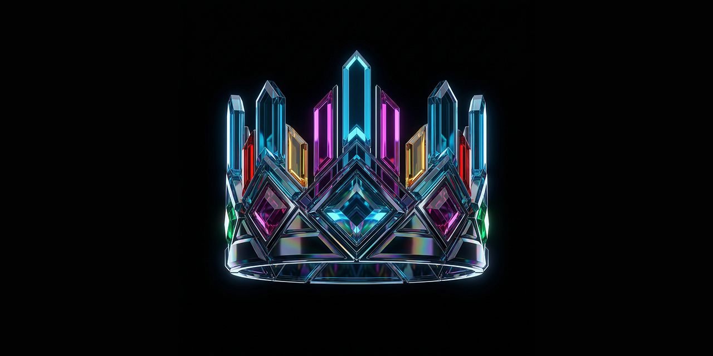

<p align="center">
  
</p>

> **[Omnidea](https://github.com/neonpixy/omnidea)** / **[Omninet](https://github.com/neonpixy/omninet)** · For AI-assisted development, see [CLAUDE.md](CLAUDE.md).

# Omninet


> **Public mirror.** Active development happens elsewhere.

A sovereign internet, built from first principles. 29 Rust crates implementing identity, encryption, storage, networking, governance, economics, and safety. Users own their identity, their data, and their history.

Omninet is a **protocol suite** (like TCP/IP + HTTP + DNS + payments), not a framework. The Rust crates define how things work. The Zig orchestrator composes them into a pipeline API. The [TypeScript SDK](https://github.com/neonpixy/library) wraps that pipeline so programs can call it from any WebView. The [Covenant](https://github.com/neonpixy/covenant) governs it all.

---

## The Stack

```
Programs (TypeScript / Swift / Kotlin / C++ / Rust)
    |
    |  import { crown, vault } from "@omnidea/net"
    v
@omnidea/net  ............  TypeScript SDK (860 typed operations)
    |
    |  window.omninet.run({ steps: [...] })
    v
libomnidea_orchestrator  ..  Zig orchestrator (~8,580 lines, pipeline executor)
    |
    |  comptime auto-dispatch to divi_* functions
    v
libdivinity_ffi  ..........  Rust FFI (1,040 C functions)
    |
    |  safe Rust behind extern "C"
    v
29 Rust crates  ...........  The protocol (6,700+ tests)
```

Programs send JSON pipeline specs. The orchestrator dispatches each step and returns results. One call, multi-step workflows, every platform.

---

## The 26 Building Blocks

| | Name | What It Does |
|---|---|---|
| **A** | **Advisor** | AI cognition. Thoughts, synapses, pluggable backends. |
| **B** | **Bulwark** | Safety and protection. Trust layers, reputation, Kids Sphere. |
| **C** | **Crown** | Identity. secp256k1 keypairs, keyring, social graph. |
| **D** | **Divinity** | Platform bridges. FFI, orchestrator, rendering pipelines. |
| **E** | **Equipment** | Communication. Phone (RPC), Email (pub/sub), Contacts, Pager, Communicator. |
| **F** | **Fortune** | Economics. Cool currency, UBI, demurrage, bearer cash, cooperatives. |
| **G** | **Globe** | Networking. Omninet Relay Protocol (ORP) -- signed events over WebSocket. |
| **H** | **Hall** | File I/O. Encrypted `.idea` packages in and out. |
| **I** | **Ideas** | Universal content format. Notes, designs, spreadsheets, stores -- all `.idea`. |
| **J** | **Jail** | Accountability. Trust graphs, graduated response, restorative justice. |
| **K** | **Kingdom** | Governance. Communities, charters, proposals, 6 voting algorithms. |
| **L** | **Lingo** | Language. Babel semantic obfuscation + universal translation. |
| **M** | **Magic** | Rendering and code projection. CRDT document state, actions, canvases. |
| **N** | **Nexus** | Federation. Export to 15 formats, import from 7, bridge to SMTP. |
| **O** | **Oracle** | Guidance. Onboarding flows, sovereignty tiers, contextual hints. |
| **P** | **Polity** | Constitutional enforcement. Rights, duties, protections as type constraints. |
| **Q** | **Quest** | Gamification. Missions, achievements, XP, challenges, cooperative raids. |
| **R** | **Regalia** | Design language. Aura tokens, Arbiter layout, Surge animation, Reign theming. |
| **S** | **Sentinal** | Encryption. AES-256-GCM, PBKDF2, HKDF, BIP-39 recovery, X25519 ECDH. |
| **T** | **Target** | Build output. (Cargo's `target/` directory.) |
| **U** | **Undercroft** | Observatory. System health, app catalog, device management. |
| **V** | **Vault** | Encrypted storage. SQLCipher manifest, collectives, lock/unlock lifecycle. |
| **W** | **World** | Digital and physical. Omnibus (node runtime), Tower (relay servers), places, meetups. |
| **X** | **X** | Shared utilities. Value types, CRDT engine, geometry, color, geo coordinates. |
| **Y** | **Yoke** | History and provenance. Versions, timelines, ceremonies, contribution graphs. |
| **Z** | **Zeitgeist** | Discovery. Tower directory, query routing, trends, caching. |

---

## Architecture

The crates build on each other in layers:

- **Spine** (zero deps): **X** (utilities), **Equipment** (inter-module communication), **Ideas** (universal `.idea` format)
- **Body** (core): **Sentinal** (encryption), **Vault** (storage), **Hall** (file I/O), **Crown** (identity), **Globe** (networking), **Lingo** (translation)
- **Systems**: **Fortune** (economy), **Kingdom** (governance), **Polity** (constitution), **Bulwark** (safety), **Jail** (accountability)
- **Mind**: **Advisor** (AI), **Magic** (rendering), **Regalia** (design language), **Divinity** (platform bridges)
- **World**: **Omnibus** (node runtime), **Tower** (relay servers), **MagicalIndex** (search), physical presence
- **Surface**: **Oracle** (guidance), **Quest** (gamification), **Zeitgeist** (discovery), **Yoke** (history), **Nexus** (federation), **Undercroft** (observatory)

---

## Quick Start

```bash
git clone https://github.com/neonpixy/omninet.git
cd omninet
cargo build --workspace
cargo test --workspace
```

For the Zig orchestrator: `cd Divinity/Orchestrator && zig build` (requires `libdivinity_ffi.a` from `cargo build`).

### TypeScript SDK

```typescript
import { crown, vault, hall } from "@omnidea/net";

const key = await crown.keyringGeneratePrimary();  // Create an identity
const doc = await window.omninet.run({              // Multi-step pipeline
  source: "my-program",
  steps: [
    { id: "key", op: "vault.content_key", input: { idea_id: "abc-123" } },
    { id: "doc", op: "hall.read", input: { path: "/notes.idea", content_key: "$key.result" } }
  ]
});
```

---

## Documentation

| Doc | What It Covers |
|-----|---------------|
| [Architecture](docs/ARCHITECTURE.md) | How the 29 crates fit together. Layer diagram, dependency graph, FFI stack. |
| [@omnidea/net](https://github.com/neonpixy/library) | TypeScript SDK — typed wrappers for 860 pipeline operations. |

Each crate has its own `CLAUDE.md` with architecture, types, and patterns. See the per-crate guides at `{Letter}/CLAUDE.md` (e.g., `Crown/CLAUDE.md`, `Globe/CLAUDE.md`).

---

## Status

The protocol layer is **complete**. 29 Rust crates, 6,700+ tests, zero clippy warnings. The Zig orchestrator covers ~99% of 1,040 FFI operations (auto-counted at comptime). The TypeScript SDK exposes 860 typed operations.

The browser is [Omny](https://github.com/neonpixy/omny) — like Chrome is to the web, Omny is to Omninet.

---

## The Covenant

Technical decisions answer to three principles:

1. **Dignity** -- worth that cannot be taken, traded, or measured.
2. **Sovereignty** -- the right to choose, refuse, and reshape.
3. **Consent** -- voluntary, informed, continuous, and revocable.

The Covenant is the project's governing framework. Technical decisions that violate these principles are rejected. See the [Covenant repository](https://github.com/neonpixy/covenant) for the full text.

## Design Principles

- **Equipment is the nervous system.** All inter-module communication goes through Pact.
- **Ideas is the universal format.** Everything is an `.idea`.
- **Extend, never break.** New features add types and traits alongside existing ones. Five architectural firewalls enforce backwards compatibility.
- **Architecture over policy.** Defenses are structural -- type constraints, not Terms of Service.
- **The Covenant is encoded in Polity.** ~70% of all Covenant Parts are expressed as type constraints in `covenant_code.rs`.

## Contributing

Omninet is open source. Contributions that strengthen the protocol while honoring the Covenant are welcome.

Before contributing, please read:
- [Architecture](docs/ARCHITECTURE.md) — understand how the pieces fit together
- [The Covenant](https://github.com/neonpixy/covenant) — the principles that govern every decision

---

## License

AGPL-3.0, governed by the [Covenant](https://github.com/neonpixy/covenant). See [LICENSE](LICENSE.md) for details.

---

Part of [Omnidea](https://github.com/neonpixy/omnidea).
